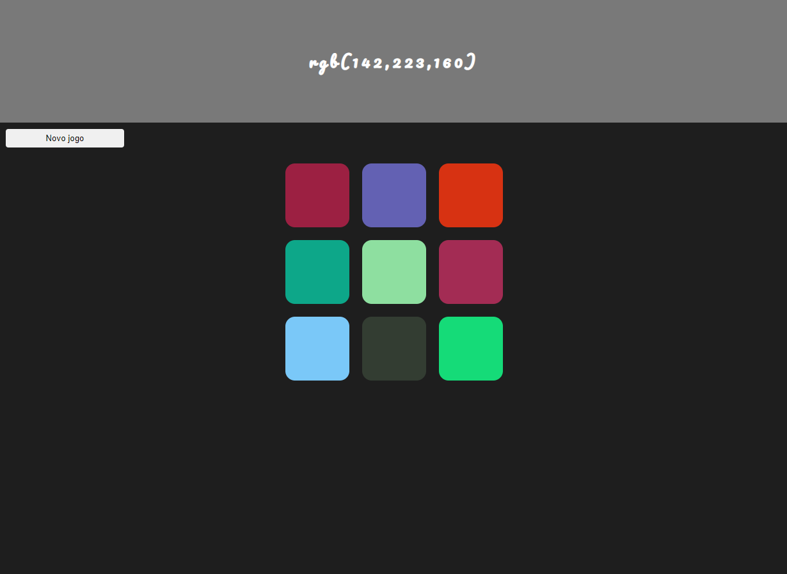

# Jogo Rgb
# Sobre o projeto

<a href="https://gmrgb.netlify.app">https://gmrgb.netlify.app</a>

Projeto feito para treinar minha lógica no JS.

Consiste em um projeto em que uma cor em formato rgb é dada e o usuário deve acertar qual cor é daquele rgb. As cores são geradas de maneira aleatória e não há limite de tentativas, pois é apenas para treinar o conceito de rgb.

## Imagem do projeto

    

# Tecnologias utilizadas
- HTML
- CSS
- JS

## Implantação
- Projeto implementado no Netlify

# Autor

Diego Cruz's

<a href="https://www.linkedin.com/in/diegoscruz">https://www.linkedin.com/in/diegoscruz</a>